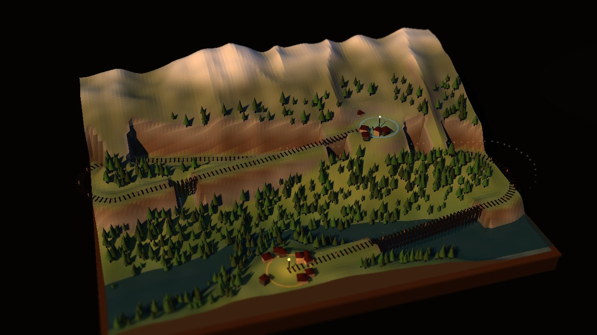
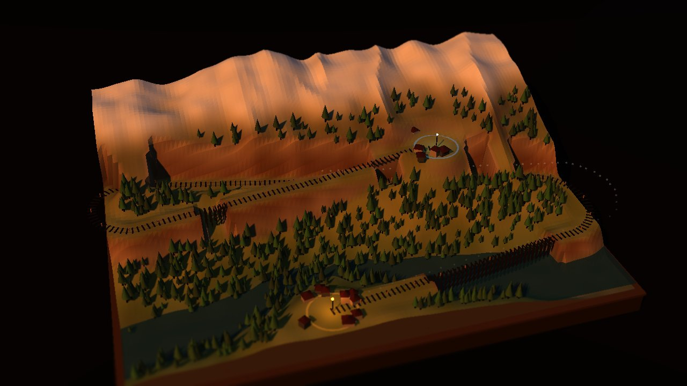
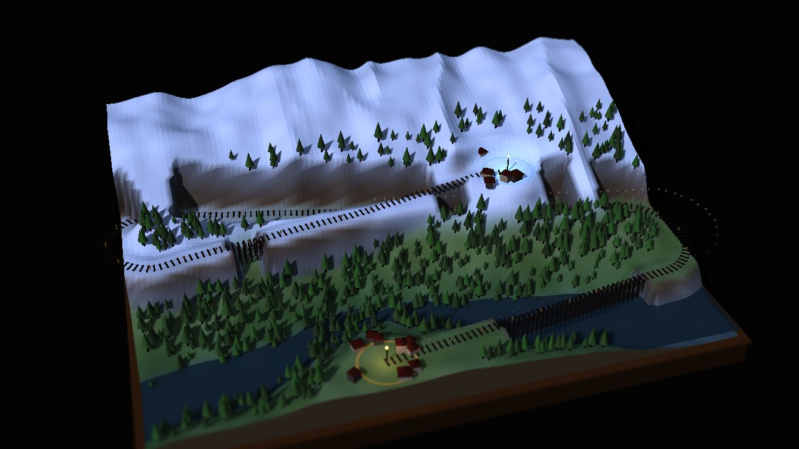
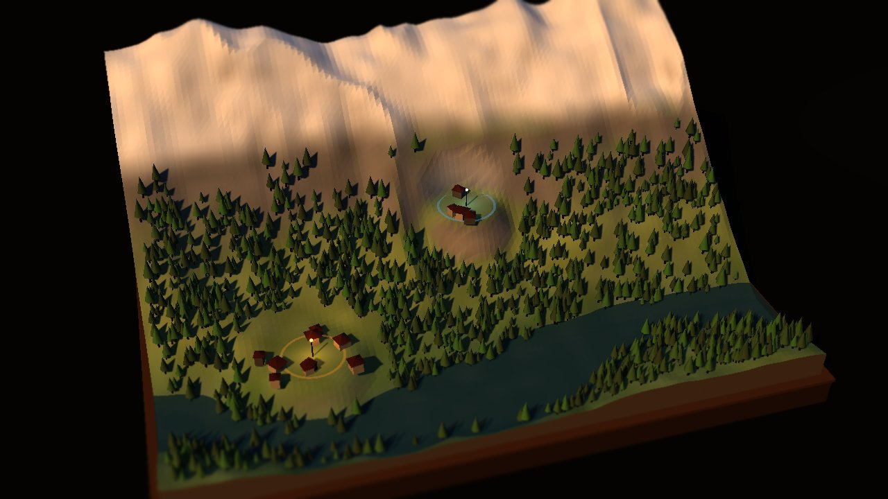
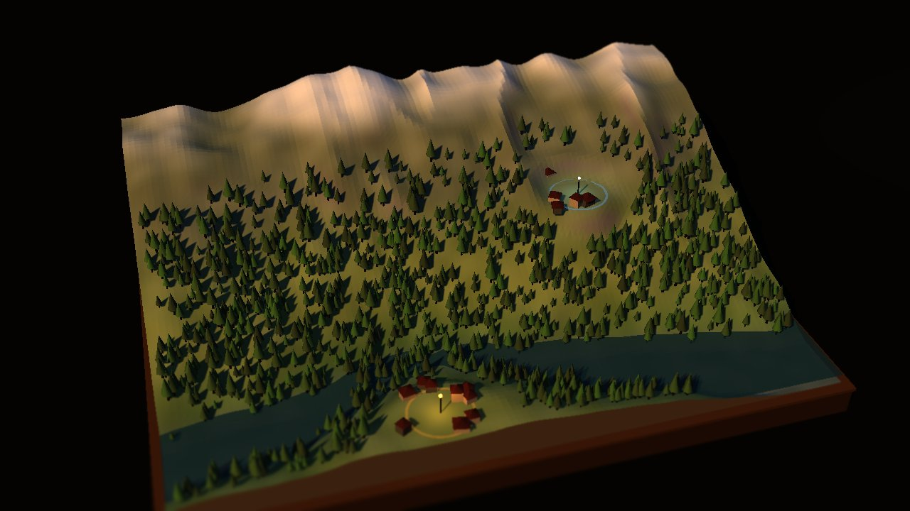

# SWITCHBACK

A cozy narrow-gauge railway builder. You survey a line from **Lowthwaite** in the
valley up to **Crag End** on the mountain shoulder, then sit back and watch the
train work its way up what you built.

**▶ Play: [switchback-mu.vercel.app](https://switchback-mu.vercel.app)**

Single-file (`index.html`), Three.js via CDN, no build step. Port **5773** locally.

Trace the line in the shot above: out of Lowthwaite by the river, east across
the hillside, a horseshoe at the board's edge, back west, and up into Crag End.
The bare earth scars are cuttings and embankments the line had to carve to hold
its grade — you can't go straight at the mountain, so you go the long way round.

Then the year turns, and finds out whether you left yourself enough margin:

| Autumn — wet leaves, holds 6.5% | Winter — frost, holds 4.4% |
|---|---|
|  |  |

## The idea

It's a **tilt-shift model railway** on a visible plywood baseboard, lit like a
model on a table in a dark room. The pillars, locked by interview:

- **Look** — tilt-shift miniature, not a naturalistic landscape.
- **Tension** — terrain engineering. The mountain fights you.
- **Play** — build, then watch. No driving.

## Stations, and why they hurt

**Rail alone earns nothing.** A village pays tax only if it has a **station** and
the rail reaches its platform. Track running past a village is just track.

And a platform cannot sit on a grade. A station needs ~18m of **level shelf** —
but your line is climbing at its ruling grade *precisely where you want one*. So
you hold **L** to lay level track through the village, and pay for it twice:

- **In climb** — 18m where the line gains nothing, on a line already fighting
  for every metre of run. You have to find that height back somewhere.
- **In money** — cutting a level shelf into a 17% hillside roughly **doubles**
  the price of the line (~£960 → ~£1,770 on a typical board).

That's the whole idea: a building that fights the terrain is a design problem; a
building you can plonk anywhere is a shop item.

The siting rule is checked and explained — *"TRACK RUNS AT 6.0% HERE — A PLATFORM
NEEDS LEVEL GROUND (HOLD L)"*.

> **Design note.** Pinning track level automatically does *not* work, and it's a
> trap worth remembering: the platform snap is opportunistic (it only fires when
> the grade can already reach the platform), so widening its radius just makes
> more pegs climb at 6% and fail. The shelf has to be a deliberate act with its
> own verb.

## The economy

Money is what makes the ruling grade a business decision rather than a taste.

**You pay for**: rail per metre, earthworks (spoil goes as depth², so one deep
cutting is far worse than two shallow ones), trestles over gaps, tunnels through
spurs. The bill is itemised live while you survey.

**You earn** tax from the villages your line serves — *but only for the seasons
it actually runs*. That is what makes the weather economic:

| Line | Cost (bare / with shelves) | Seasons it runs | Tax / year |
|---|---|---|---|
| **6% bold** | £959 / ~£1,770 | 2 (summer, autumn) | £700 |
| **4% gentle** | £2,243 / more | 4 | £1,400 |

The opening grant is **£2,400** — enough for a bold line *and* its two stations
(~£2,250), nowhere near a gentle one. So the arc is: build cheap, run it, earn, and buy your way to the
all-weather line (~1.5 years). Towns also grow by how well they're *served*
(~2% per season the line ran), so the gentle line earns twice **and** compounds
twice.

Capital is **committed, not burned** — tearing up the line frees the money back.
Forgiving on purpose: the decision worth having is which line to build, not
whether you dare experiment.

## The decision: ruling grade vs the weather

The loop's teeth. You **declare** how hard your line will ever climb (6% / 5% /
4%) and the survey holds you to it. Then the year tests it.

Adhesion is the real formula, so weather and load fall out of one line:

    stall grade = μ · (adhesive weight / total weight)

μ is the railhead (dry → wet leaves → frost); the weight ratio is the load. That
is why hanging more wagons on the back will work without touching the physics.

| Season | Railhead | Holds |
|---|---|---|
| SUMMER | dry rails | 9.0% |
| AUTUMN | wet leaves | 6.5% |
| WINTER | frost | 4.4% |
| SPRING | thaw, wet | 5.4% |

Which gives the ladder (all verified end-to-end against the real sim):

| Declared | SUM | AUT | WIN | SPR | Held |
|---|---|---|---|---|---|
| **6% bold** | 35s | 38s | STALL | STALL | 2/4 |
| **5% standard** | 35s | 37s | STALL | 41s | 3/4 |
| **4% gentle** | 60s | 63s | 70s | 66s | **4/4** |

A steep line is short and only open in summer. An all-weather line costs you
~90% more track — **and may not fit on the mountain at all**, which is the whole
trade. `newBoard` probes each grade and tells you up front which ones fit.

Surviving a season banks it (the pips) and turns the year. Holding all four is
the actual win — "connected" is just the start.

**Changing your mind is cheap**: `resurvey()` re-lays the existing plan under a
new ruling grade, keeping your pegs' x/z and only recomputing heights. Changing
your mind should cost you the argument, not twenty minutes of routing.

## Why the mountain is the game

Crag End sits **5.0m above** Lowthwaite, but only **29m away** — a direct line is
a **16.8% grade**. The engine's ruling grade is **6%**. So:

- You need **83m of run minimum** to gain 5m at 6%. A working line comes out
  around **140–150m** — roughly **3× the direct distance**.
- The board is only 52m wide, so 140m of track *cannot* fit in one straight
  shot. It has to zigzag, with horseshoes at the board edges.

That constraint is the whole design. The terrain generator authors the puzzle
for free; there's no hand-placed level.

## The survey rule (the thing to understand)

**A surveyor doesn't trace the ground — they hold a gradient and let earthworks
absorb the difference.** So a peg's rail height is the ground height *clamped* to
what the previous peg's 6% allows, and it never dips into a hollow it would have
to climb back out of.

Everything else falls out of that:

- Fight the hill and the **cut/fill balloons** — past 5m it's unbuildable.
- Fill over ~1.9m becomes a **trestle**; cut past 3m becomes a **tunnel**.
- The station platform is at a **fixed height**, so arriving is purely a
  question of whether you gave yourself enough run.

Meeting a platform is a *preference*, not a requirement — a line often passes
under its own destination on the way out to a horseshoe. That's ordinary track,
not a failed station. `connected()` requires the rail to actually be *at*
platform height, not merely near it in plan.

## Controls

| | |
|---|---|
| **LMB** | lay a survey peg |
| **L** | toggle **level** track — how you build a station shelf |
| **Q / E** | cut / fill (bias the formation down or up) |
| **R** | reset the held height |
| **Shift** + click | force a peg, ignoring the grade clamp (this is how you stall a train) |
| **RMB** drag | orbit · **MMB** pan · **wheel** zoom |
| **Backspace** | undo · **Enter** run · **Esc** settings |

## Boards are generated, and gated

Each board rolls a `SHAPE` (summit height, headwall abruptness, gully depth,
river meander, valley floor) plus ridged noise for **spurs and gullies running
down the fall line** — the features the survey has to work around.

| seed 1234 — steep headwall, deep gully | seed 55555 — broad massif, serrated spurs |
|---|---|
|  |  |

`newBoard(seed)` will not hand you a board it hasn't proved. It rejects:

- **too flat** — gain < 3.6m, or a direct grade under 11.5% (no switchback needed)
- **underwater** — `siteA.h` below the waterline. This one bites: `findSite`
  rewards flatness, and the terrain's clamp floor makes the riverbed *perfectly*
  flat, so the valley station gets placed in the river unless you stop it.
- **unclimbable** — `probeSolvable()` fails

`probeSolvable()` is the offline A* ported in-game: state is `(cell, railhead
height)`, because where you can reach depends on how high you already are.
~100ms per board, so the gate is invisible. Height bins are **FLOORed, never
rounded** — rounding lets each step steal half a bin of free climb, which
compounds into a "solution" that beats the grade limit (it reported a 66m line
for a climb needing 83m).

## Opening / settings / tutorial

- **Opening** — title card explains the 6%-vs-17% premise before you touch anything.
- **Settings** (Esc) — tilt-shift (off/subtle/full), shadows, grade tint, tree
  density, and the seed (type one, or roll).
- **Tutorial** — 5 lessons, each waiting on a *real game condition*, not a click.
  Advances **greedily** (`while` not `if`) so solving two lessons at once doesn't
  strand you, and every condition has an escape hatch — an early draft gated
  lesson 3 on hovering near Crag End, which soft-locked anyone who played in a
  different order.

## Verified

Via `__dbg` (see below), on the real build:

| Line | Ruling | Cut/fill | Buildable | Connects | Train |
|---|---|---|---|---|---|
| Switchback, 3 route widths | 6.00% | 3.68m | yes | yes | **arrives ~60s** |
| Straight at the summit | 6.00% | 3.18m | — | **no** (3.18m short of platform) | — |
| Shift-forced straight | 16.8% | — | — | — | **stalls** |

## Debug hooks — `window.__dbg`

Module-scoped state isn't on `window`; this is the seam.

- `autoline([[x,z],…], override)` — lay a route with the same survey rules as the
  mouse. Returns `{totalLen, ruling, maxCutFill, buildable, connected, rejected}`
  where `rejected` explains every peg a real click would have refused.
- `sim(maxT)` — run the train headlessly, returns `{arrived, stalled, t, maxV}`.
- `start() / stop() / step(dt)` — drive the run manually (for screenshots).
- `cam(x,y,z,tx,ty,tz)`, `ts(focus,band,strength)` — camera / tilt-shift.
- `shot(q)` — JPEG data URL. See the screenshot-pipeline memory; `computer`
  screenshots wedge on this WebGL canvas.
- `samples() / grades() / cum() / state()` — raw line data.

## Traps this code already fell into

Documented because each one produced a *plausible-looking* wrong result:

1. **Don't spline height in 3D.** A Catmull-Rom through 3D points overshoots
   vertically and invents 7%+ pitches on a line where every peg obeys 6%. Spline
   the **plan only**; interpolate height per segment.
2. **Interpolate height against arc length, not the curve parameter.**
   Centripetal Catmull-Rom bunches samples near the ends — lerping `y` on `t`
   put a **55% cliff** in the first 20cm of a dead-straight line.
3. **Decide bridge/tunnel from the ground under the rail, not per terrain
   vertex.** Per-vertex, the uphill batter of every cutting looks like a tunnel
   and gets skipped, leaving a sheer black wall beside the track.
4. **Never teleport the rail onto a platform.** A 6cm snap over a 14cm final peg
   is a 43% kink. Snap only as far as the grade allows.
5. **Stall detection can't rely on rollback velocity** — a train starting on a
   wall has `s` clamped at 0 and `v` reset every frame, so it never crosses the
   threshold. Test whether the engine *can pull* the grade.
6. **A_MAX must sit well above MAX_GRADE.** At 0.62 the stall grade was 6.33%,
   so a line built exactly to the legal 6% crawled at 0.27 m/s and never
   arrived. 1.05 → holds ~1.9 m/s at 6%, stalls at 10.7%.
7. **Trees must be replanted on `dispH`** after earthworks, or they hang in the
   air over their own cutting.
8. **Rolling stock is modelled +X-forward; the track convention is +Z-forward.**
   Sleepers want +Z (their long axis lies across the rails), so sharing the yaw
   made the train run *sideways* — and the pitch term then *rolled* it rather
   than tipping it. Each car wraps its body in a group at `rotation.y = -π/2`.
9. **`__dbg` must expose siteA/siteB as GETTERS.** `buildField()` reassigns them
   on every reseed, so a captured value reports the first board's termini
   forever — it looked like the generator wasn't varying at all.
10. **Coupling distance is a chain of adjacent half-length pairs.** Referencing
    `consist[i]` inside the `k` loop adds this car's half-length once per car
    ahead of it, and the rake stretches apart.
11. **Tractive effort must NOT fall linearly from zero with speed.** The old
    `aMax·(1 − v/V_MAX)` tied climbing *speed* to adhesion *margin*, so any line
    built near the day's limit crawled at 0.4 m/s and never arrived — fatal,
    because weather only bites when the limit is close. Effort now holds flat to
    ~0.75·V_MAX; **drag** sets terminal speed. A thin margin still runs at a
    watchable pace.
12. **Wheelslip is a cliff, not a slope.** Modelling adhesion loss as gentle
    deceleration let a train at 3 m/s coast ~70m up a grade it could not hold
    and arrive anyway — every marginal weather call was a lie, and the ladder
    collapsed (a 5% line was surviving a 4.38% railhead). Real wheelslip
    collapses tractive effort to a fraction the moment demand exceeds adhesion.
    That single change made the ladder exact.
13. **Measure the ruling grade over the window the physics integrates.** The
    grade under the whole *rake* (`SUSTAIN_WIN`), not under a point — otherwise
    "worst sustained" on the HUD isn't the number that makes her slip.
14. **Compare grades with an epsilon.** The clamp lands grades EXACTLY on the
    ruling, and float error makes 0.06 read as 0.0600000001 — so `> RULING_MAX`
    accused every legal line of being "FORCED". Compare to the *declared*
    ruling + 1e-6.
15. **Price the rate card by measuring real lines.** A first pass by feel put
    tunnelling at £55/m and nothing was affordable — the cheapest line was
    £1,948 against a £900 grant, and a 5% line came to £3,555 of which £2,501
    was tunnel. Build a line, print the itemised bill, then set the rates.

## Roadmap

Next, in order:

1. **Map expansion** — Cities:Skylines-style: buy the next tile at the board
   edge. Heaviest refactor (terrain grid, baseboard, skirt, and the solvability
   gate all assume one fixed board with one fixed pair of termini).
2. **Rail types** — adhesion vs **rack/cog**: climbs 20%+, *cannot wheelslip* so
   it's immune to frost, but costs a fortune per metre and crawls. One option
   that interacts with grade, cost and weather at once.
3. **Landmarks + building variety** — tarns, crags, waterfalls, ruins, quarries;
   varied building types that restructure and grow tiers as rail serves them.
4. **Villagers** — actual little people on the board.

Held back deliberately:

- **Water towers** (loco range ~180m, so the long gentle line needs a water stop
  — the downside the gentle line currently lacks) and **sand houses** (buy
  adhesion at one bank). Both good; both wanted a session of their own.
- **Snow sheds** — they'd let you buy your way out of the weather trade-off,
  which is the best thing in the game. Not until the economy is deeper.
- **Signal boxes, passing loops** — nothing to signal with one train.
- **Goods sheds** — a pure income multiplier is a number with a roof.

## Roadmap

- Cost/budget as a real constraint (the £ figure is currently just for pride)
- Tunnel portals; proper trestle decks rather than bare legs
- Seasons on the diorama; passengers/goods at the stations
- More boards (each one a different mountain), spiral loops
